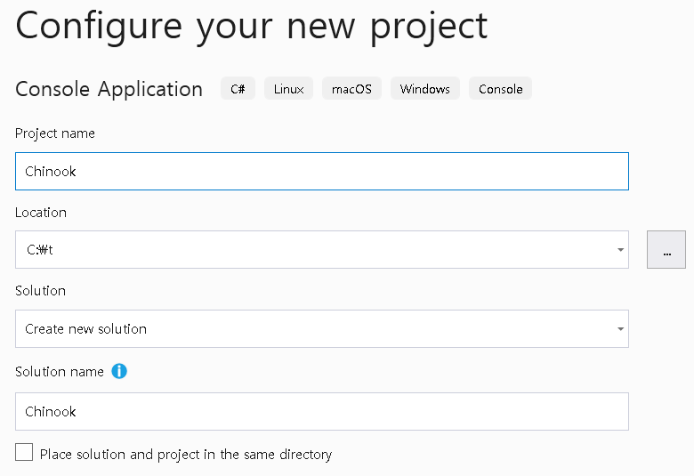
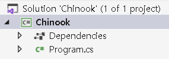
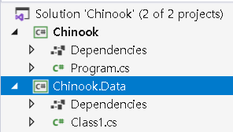
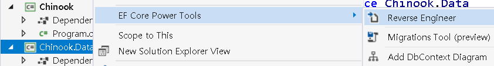
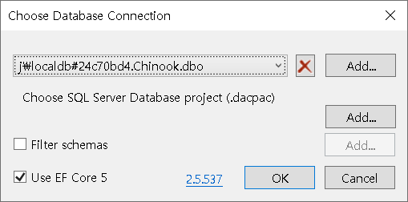
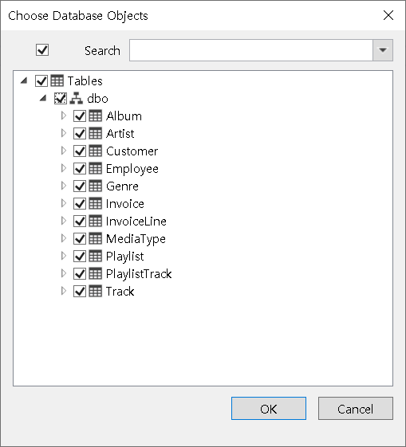
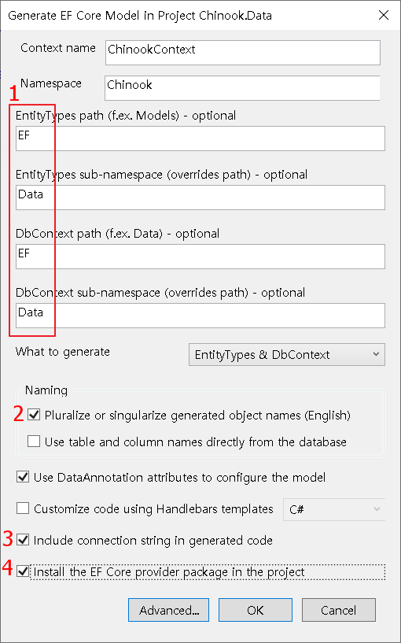
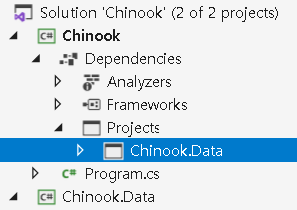
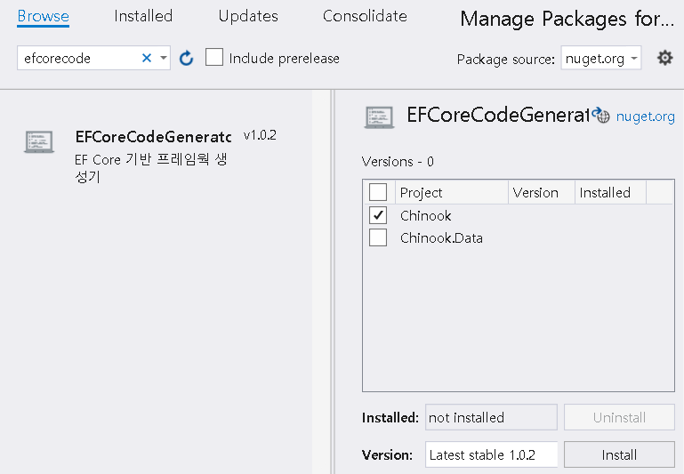
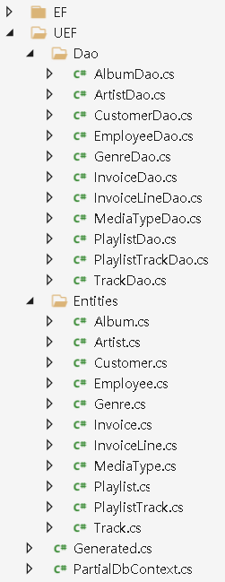

# Entity Framework Core Code Generator

A code generator which helps you use well-structed Entity Framework Core

---------------------------------------
## Quick Start I (Entity Framework Core)
0. We will use [MSSQL Server LocalDB](https://docs.microsoft.com/ko-kr/sql/database-engine/configure-windows/sql-server-express-localdb?view=sql-server-ver15) and open source DB [Chinook](https://github.com/lerocha/chinook-database/blob/master/ChinookDatabase/DataSources/Chinook_SqlServer_AutoIncrementPKs.sql). Following connecton string should be prepared.

`Data Source=(Localdb)\MSSQLLocalDB;Initial Catalog=Chinook;Integrated Security=True`

1. Create a solution whose name is `Chinook` and a `Console Application` project whose name is also `Chinook` in Visual Studio.



2. Add a `Class Library` project(`Chinook.Data`) to the solution.


3. Scaffold Entity Framework Core code from `Chinook` database using [EF Core Tools](https://docs.microsoft.com/en-us/ef/core/cli/dotnet#dotnet-ef-dbcontext-scaffold). but [EF Core Power Tools](https://marketplace.visualstudio.com/items?itemName=ErikEJ.EFCorePowerTools) is recommended coz it is more convenient

4. Right click on `Chinook.Data` project and select `EF Core Power Tools -> Reverse Engineer`.


5. Select `Chinook` database and click OK.


6. Select all tables.


7. Enter values like following.

  * DbContext class and entity classes will be generated in *EF* direcotry and their sub namespace will be *Data*

8. In `Chinook` project, add project reference to `Chinook.Data` project.


9. Write following code in Program.cs of `Chinook` project to check Entity Framework Core is working. This code is example of printing count of Queen's album.
```csharp
static void Main(string[] args)
{
    using ChinookContext context = new ChinookContext();

    Artist queen = context.Artists.FirstOrDefault(x => x.Name == "Queen");
    List<Album> albums = context.Albums.Where(x => x.ArtistId == queen.ArtistId).ToList();

    foreach (Album album in albums)
        Console.WriteLine($"{album.AlbumId} / {album.Title}");
}
```
## Quick Start II - EF Core Code Generator
1. Add `EFCoreCodeGenerator` package reference to `Chinook` project.


2. Write following code in Program.cs of `Chinook` project to generate codes.
```csharp
static void Main(string[] args)
{
    EFCoreCodeGenerator.CodeGenerator.Generate(
        new ChinookContext(), 
        @"C:\t\Chinook\Chinook.Data", 
        @"C:\t\Chinook\Chinook");
}
```
  * "C:\t\Chinook\Chinook.Data" is the location of ChinookContext class.
  * "C:\t\Chinook\Chinook" is the location of Code Generation Template. I will explain about Code Generation Template later.

3. Generated Codes are located in UEF directory of `Chinook.Data` project.


4. Now you can write Queen's-album-counting code as following.
```csharp
static void Main(string[] args)
{
    Artist queen = Dao.Artist.GetFirst(x => x.Name == "Queen");
    List<Album> albums = Dao.Album.GetByArtistId(queen.ArtistId);

    foreach (Album album in albums)
        Console.WriteLine($"{album.AlbumId} / {album.Title}");
}
```
Check out `Dao.Album.GetByArtistId` method which takes ArtistId(foreign key of Album) is automatically generated.

---------------------------------------

## Generated Code
### DAO
* Every entity generates its own Dao class and each Dao class has following methods
* *every method above has its async counterpart too.*

1. GetByKey
```csharp
// an album whose AlbumId is 1
Album album = Dao.Album.GetByKey(1); 
```

2. GetBy[ForeignKey]
```csharp
// a list of album whose ArtistId is 1
List<Album> albums = Dao.Album.GetByArtistId(1); 
```

3. GetFirst
```csharp
// first album
Album album = Dao.Album.GetFirst(); 
// first album whose ArtistId is 1
Album album = Dao.Album.GetFirst(x => x.ArtistId == 1); 
// first album ordered by Title
Album album = Dao.Album.GetFirst(x => x.Title); 
// first album whose ArtistId is 1 ordered by Title
Album album = Dao.Album.GetFirst(x => x.ArtistId == 1, x => x.Title);
```

4. GetLast
```csharp
// last album
Album album = Dao.Album.GetLast(); 
// last Album whose ArtistId is 1
Album album = Dao.Album.GetLast(x => x.ArtistId == 1); 
// last Album ordered by Title
Album album = Dao.Album.GetLast(x => x.Title); 
// last Album whose ArtistId is 1 ordered by Title
Album album = Dao.Album.GetLast(x => x.ArtistId == 1, x => x.Title); 
```

5. GetCount
```csharp
// count of album
var count = Dao.Album.GetCount(); 
// count of album where ArtistId is 1
var count = Dao.Album.GetCount(x => x.ArtistId); 
```

6. Get
```csharp
// list of all albums
List<Album> albums = Dao.Album.Get();
// list of albums where ArtistId is 1
List<Album> albums = Dao.Album.Get(x => x.ArtistId == 1);
// list of albums ordered by Text in ascending
List<Album> albums = Dao.Album.Get(x => x.Title, true);
// list of albums where ArtistId is 1 ordered by Text in ascending
List<Album> albums = Dao.Album.Get(x => x.ArtistId == 1, x => x.Title, true);
// list of 10 albums skipping 20 where ArtistId is 1 ordered by Text in ascending 
List<Album> albums = Dao.Album.Get(x => x.ArtistId == 1, x => x.Title, true, 20, 10);
```

7. Select
```csharp
// list of Titles of all albums
List<string> titles = Dao.Album.Select(x => x.Title);
// list of Titles of albums where ArtistId is 1
List<string> titles = Dao.Album.Select(x => x.AlbumId == 1, x => x.Title);
// list of Titles of albums ordered by Text in ascending
List<string> titles = Dao.Album.Select(x => x.Title, true, x => x.Title);
// list of Titles of albums where ArtistId is 1 ordered by Text in ascending
List<string> titles = Dao.Album.Select(x => x.ArtistId == 1, x => x.Title, true, x => x.Title);
// list of Titles of 10 albums skipping 20 where ArtistId is 1 ordered by Text in ascending 
List<string> titles = Dao.Album.Select(x => x.ArtistId == 1, x => x.Title, true, 20, 10, x => x.Title);
```

8. Exists / ExistsByKey
```csharp
// does album exists whose AlbumId is 1?
bool exists = Dao.Album.ExistsByKey(1);
// does album exists whose Title is "Big Ones"?
bool exists = Dao.Album.Exists(x => x.Title == "Big Ones");
```

9. Insert
```csharp
// insert an album. if same album exists, an exception will be thrown.
Album album = new Album {Title = "new album", ArtistId = 1};
Dao.Album.Insert(album);
```

10. InsertIfNotExists
```csharp
// insert an album if it does not exists in datbase.
Album album = new Album {Title = "new album", ArtistId = 1};
Dao.Album.InsertIfNotExist(album);
```

11. InsertOrUpdate
```csharp
// insert an album if it does not exists in database. if exists, the Album will be updated.
Album album = new Album {Title = "new album", ArtistId = 1};
Dao.Album.InsertOrUpdate(album);
```

12. InsertMany
```csharp
// insert many albums at once with trasaction.
List<Album> albums = new List<Album>{ /* ... */};
Dao.Album.InsertMany(albums);
```

13. Update
```csharp
// update an album
Album album = Dao.Album.GetByKey(1);
album.Title = "new album";
Dao.Album.Update(album);
```

14. UpdateMany
```csharp
// update many albums at once with trasaction.
List<Album> albums = new List<Album>{ /* ... */};
Dao.Album.UpdateMany(albums);
```

15. DeleteByKey
```csharp
// delte album whose AlbumId is 1
Dao.Album.DeleteByKey(1);
```

16. DeleteAll
```csharp
// delete all albums whose Text contains "rock"
Dao.Album.DeleteAll(x => x.Title.Contains("rock"));
```
#### Entity
1. ToString (overriden)
```csharp
// returns string with all values of properties
Album album = Dao.Album.GetByKey(5);
Console.WriteLine(album.ToString());
// [AlbumId]5, [ArtistId]3, [Title]Big Ones
```

2. PrimaryKeyValues
```csharp
// returns string with primary key value(s)
PlaylistTrack item = Dao.PlaylistTrack.GetByKey(1, 3402);
Console.WriteLine(item.PrimaryKeyValues);
// 1:3402
```

3. BeginEdit / CancelEdit
```csharp
Album album = Dao.Album.GetByKey(5);
Console.WriteLine(album.Title); // Big Ones
album.BeginEdit();
album.Title = "modified";
album.CancelEdit(); // modified Title has gone
Console.WriteLine(album.Title); // Big Ones
```

---------------------------------------

## Examples

### Albums with ArtistName (avoiding n+1 problem)
1. Write following code to `Chinook.Data\UEF\Entities\Album.cs` which already generated.
```csharp
public partial class Album
{
    public string ArtistName { get; internal set; }                
}
```

2. Write following code to `Chinook.Data\UEF\Dao\AlbumDao.cs` which already generated.
```csharp
public List<Album> GetWithArtistName()
{
    using var context = ChinookContext.Create();

    var query = from x in context.Albums
                select new {Entity = x, ArtistName = x.Artist.Name};

    var list = query.ToList();

    foreach (var x in list)
    {
        x.Entity.ArtistName = x.ArtistName;
    }

    return list.ConvertAll(x => x.Entity);
}
```

---------------------------------------

## Code Generation Template

* When you run `CodeGenerator.Generate` method, `templates` directory will be generated and there are some Code Generation Templates in there.
* You can customize generated code by modifying Code Generation Template(s).
* Each Code Generation Template consists of header and body.
### Header
```
{
	"Version":1, // version (don't modify this)
	"Scope":0, // scope of template. 0:per project, 1:per entity.
	"TargetPath":"Generated.cs", // path of generated code (relative to default directory(UEF))
	"Overwritable": true // if true, it will overwrite exist file
}
```

### Body
* Code Generation Template uses a mini script language with its own grammer.
* Followings are EBNF of the language
```
template = {database | table loop | table | column loop | comment | variable | character} ;
database = "<#D " , "Name" | "CamelName" | "PascalName" | "DataContext" , " D#>" ;
table loop = "<#A " , table loop type , ":", {loop separator} , ":", {character | table} , " A#>" ;
table loop type = "AL" | "TB" | "VW" ; 
loop separator = "[N]" | "[T]" | character ;
table = "<#T " , "Name" | "CamelName" | "PascalName" | "BeginOnView" | "EndOnView", " T#>" ;
column loop = "<#O " , column loop type , ":" , {loop separator} , ":", {character | column} , " O#>" ;
column =  "<#C " , "Name" | "CamelName" | "PascalName" | "Type",  " C#>" ;
column loop type = "AL" | "PK" | "NP" | "IN" | "NI" | "FK" | "NF"; 
variable = "<#V ", {character}, " V#>";
comment = "<#- ", {character}, " -#>";
character = [a-z] | [A-Z] | [0-9] | white space ;
```
* A parser which understands above grammer is included.